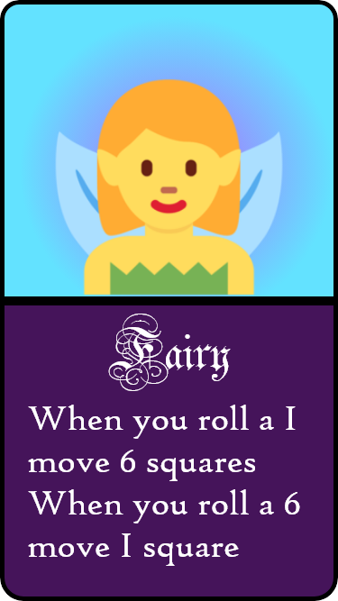

# Rules
Players shuffle the cards and then each player takes 1 card. The card determines the player character. There are 4 characters- Human, Zombie, Fairy and Snake. The players keep it a secret which team they are.

## Accusing
If another player suspects that another player is bluffing, he/she can call him/her out. The acccused player must then reveal their card.

If the accuser was right about the bluff, accused player skips a turn.
If the accuser was wrong, the accuser skips a turn.

In both cases, the accused player gets a new card.

## Cards:

